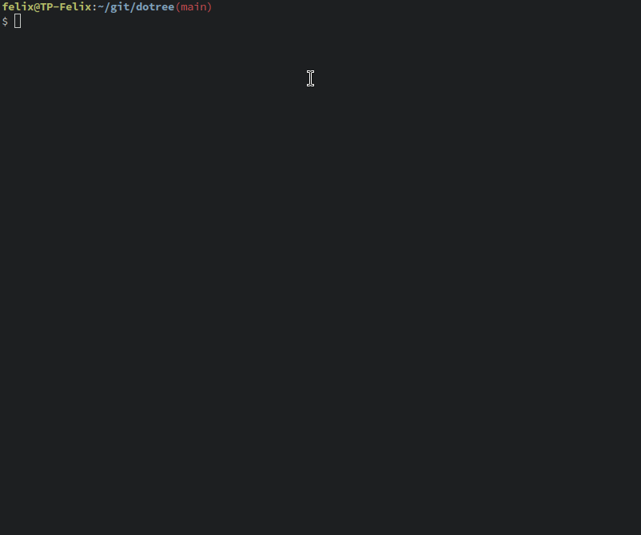

dotree is a small interactive command runner. I want's to be a better home for your
aliases and bash functions, especially those that you don't use that often, and an 
alternative to [just](https://github.com/casey/just).



Given a config file like this: 

```
menu root {
	g: git
	m: misc
}

menu git {
	am: "amend" - "git commit --amend --no-edit"
	aam: "all amend" - "git commit -a --amend --no-edit"
	ca: "git commit -a"
	b: "git switch $(git branch | fzf)"
	w: cmd {
		vars output_dir, branch
		"add worktree" - "git worktree add -b $branch $output_dir"
	}
}

menu misc {
	mn: "mount-netdrives"
	un: "unmount-netdrives"
	cv: "connect-vpn"
}
```

it presents you with the options to execute the commands configured in the file
by typing the configured key. For Example: with the given config file above, I could 
start dotree by typing `dt` (after it was installed), and then type `gb` while dotree is
running to execute `git switch $(git branch | fzf)` in bash. 

Alternativly you can also do that by entering `dt gb`. If you provide an argument, it's
characters will be processed as if you typed them when the program is running.

A command can either be declared as quick command, i.e. a string that contains bash code,
optionally with another string and a `-` in front of it, to have a name displayed in place
of the bash code, or as command via the `cmd` keyword, which allows for the additional
definition of variables that will be queried and then passed as env vars to the bash invocation.
To query the input, [rustyline](https://github.com/kkawakam/rustyline) is used, and you have 
path completion and a history.

An alternate form of strings are protected strings: `!"<content>"!`, in which case you can use 
`"` freely within the string. and in case you even need `!"` in a string, you can add any
characters between the `!` and the `"`. The characters are not mirrored on the closing 
delimiter. So `!ab"<content>"ab!` is valid, but ~`!ab"<content>"ba!`~ is not.

For an example of a real world config, [click here](./example.dt)

### Command Arguments

Commands can have arguments, which will be queried interactively, like this:

```
...
menu git {
	...
	w: cmd {
		vars output_dir, branch
		"add worktree" - "git worktree add -b $branch $output_dir"
	}
}

...
```

The values are exposed via environment variables to the callee.
If you invoke dt with additional arguments, the additional arguments will be used as values
for the vars. For example: `dt gw fknorr/some-feature /tmp/worktree_dir`.

### Repeating Commands

You can configure dotree to continue after a command was executed, so that you can trigger 
the command again with a single keypress. This is usefull for example, if you want to 
change screen brightness when you don't have a keyboard with appropriate keys:

```
menu root {
	m: brightnessctl
}

menu brightnessctl {
	+: cmd {
		set repeat
		"brightnessctl set +10%"
	}
	-: cmd {
		set repeat
		 "brightnessctl set -10%"
	}
}
```

You can also add `ignore_result` as a config option, in which case dotree won't escape
when the command has a non-zero exit code, like this:

```
menu brightnessctl {
...
	+: cmd {
		set repeat, ignore_result
		"brightnessctl set +10%"
	}
...
```

### Naming Menus

You can also assign a different display name to a menu, like this:

```
menu "Worktree" git_worktree {
	...
}
```

### Local mode

If you start dotree with -l, it will search for a dotree.dt file between the cwd and the file
system root. If it finds one, it uses it instead of the normal config file, and changes the
working directory before executing commands, to the containing directory. This way, you can 
use dotree as a more interactive version of [just](https://github.com/casey/just). I aliased
`dt -l` to `dtl`

### Default Shell

By default, dotree uses "bash -euo pipefail -c" as shell invocation on linux, or "cmd /c" on 
windows. The shell string is always appended as last argument. You can change the default shell
by setting the environment variable `DT_DEFAULT_SHELL` or on a per file basis, by placing
a shell directive as first element in the config file like this:

```
shell sh -c

menu root {
	g: git
	m: misc
}
...
```

It is also possible to change the shell for a command, by putting a shell directive into a
command like this:

```
menu root {
	p: cmd {
		shell python -c
		"python hi" - !"print("hello from python")"!
	}
}
```

### Alternative Config Path

By default, dotree looks at a file named `dotree.dt` in the XDG config dir, you can make 
it look somewhere else with the `-c` command line argument

## Installation

Download the appropriate binary for your platform (windows is untested) from the release page, 
or install via cargo: `cargo install --git https://github.com/knorrfg/dotree`.
